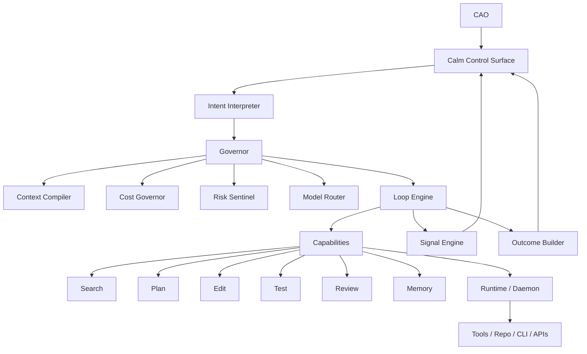

# CIAO v0.2 PRD：AI-Native Chief Intelligent Agent Officer

> 产品名称：Chief Intelligent Agent Officer  
> 简称：CIAO  
> 唯一人类角色：CAO，Chief Agent Officer / Chief AI Officer  
> 产品定位：一个 iOS 般优雅、轻量、留白、清晰的 AI-native agents 控制面板  
> 核心思想：**只有一个人类 CAO，其余全是 agents。CAO 不管理 todo list，不维护 Notion 式计划表，只表达意图、做关键判断、接收结果。**

---

# 0. 这版 PRD 的根本转向

上一版 CIAO 的问题是：它虽然强化了 token 成本和多 Agent 架构，但仍然保留了太多传统工程管理工具的影子：issue、task、board、agent list、timeline、budget table、artifact table、workflow graph。这些东西对系统有用，但对人类不优雅。

这版 CIAO 从第一性原理重写：

> 人类不是项目经理，Agent 也不是被塞进 Todo List 的虚拟员工。  
> 人类是 CAO，负责表达意图、设定边界、作出少量关键判断。  
> Agents 是智能系统的内部执行单元，默认隐藏在控制面板背后。

CIAO 不做一个“人类项目管理工具 + Agent 插件”。  
CIAO 要做一个 **AI-native operating surface**。

---

# 1. 第一性原理

## 1.1 人类真正想要的不是管理 Agent

人类不想：

- 创建 agent
- 给 agent 分配任务
- 看 agent 队列
- 拖动看板卡片
- 维护状态字段
- 配置复杂 workflow
- 研究 token 表格
- 手动判断 planner / executor / reviewer 怎么组合

人类真正想要：

- 我想实现一个结果
- 我想知道现在进展如何
- 我想知道哪里需要我判断
- 我想知道风险和代价
- 我想一键批准、暂停、收紧、放开、回滚
- 我想最终拿到可用结果

所以 CIAO 的第一原则：

> **CAO 只控制意图、边界、判断和结果，不控制 agent 的内部劳动过程。**

---

## 1.2 Agent 不应该被拟人化管理

传统设计喜欢把 Agent 做成“员工”：头像、名字、岗位、任务、进度条、日程、绩效。

这是一种过渡形态，但不是 AI-native。

Agent 的本质不是员工，而是：

- 能力模块
- 推理过程
- 工具调用者
- 上下文消费者
- 状态转换器
- 成本消耗单元
- 可组合智能动作

所以 CIAO 不应该让 CAO 管理“很多 AI 员工”，而应该让 CAO 操作一个高层智能系统。

第二原则：

> **Agent 是系统内部器官，不是 UI 上到处乱跑的员工。**

---

## 1.3 控制面板不是 Dashboard，而是 Cockpit

Dashboard 是给分析师看的。Cockpit 是给驾驶员用的。

Dashboard 强调多图表、多指标、多维度。  
Cockpit 强调：当前状态、关键告警、下一步动作、最小控制杆。

CIAO 的界面不应像 Notion、Jira、Linear、Asana，也不应像云厂商控制台。  
它应该更像：

- iOS Home Screen
- Apple Watch rings
- Tesla 中控
- Arc Command Bar
- Raycast
- Linear 的极简交互
- ChatGPT 的自然语言入口

第三原则：

> **默认隐藏复杂性，只在必要时显露最小可行动信息。**

---

## 1.4 成本控制不应该变成成本管理工作

低 token 是 CIAO 的核心能力，但 CAO 不应该天天盯着 token 表。

CAO 只需要知道：

- 这件事大概贵不贵
- 当前是否超出正常范围
- 系统是否正在用省钱模式
- 是否值得升级强模型
- 是否需要我批准更高预算

第四原则：

> **Token budget 是自动驾驶系统，不是报销表。**

---

## 1.5 AI-native 的基本交互是 Intent → Loop → Outcome

传统软件流程：

```text
Create task → Assign agent → Configure workflow → Monitor progress → Review artifact → Close task
```

CIAO 流程：

```text
Intent → CIAO runs loops → CAO makes key calls → Outcome
```

核心对象不再是 Issue / Task / Agent，而是：

```text
Intent      人类意图
Loop        系统内部智能循环
Signal      系统对 CAO 暴露的状态信号
Decision    需要 CAO 判断的最小问题
Outcome     最终结果
Memory      沉淀下来的经验
```

---

# 2. 产品愿景

CIAO 是 CAO 的智能控制面板。

CAO 打开 CIAO，不是为了“管理很多 AI 员工”，而是为了掌控一个随时待命的智能工程组织。

CIAO 应该给 CAO 这几种感觉：

1. **轻松**：不需要学习复杂系统。
2. **清晰**：任何时候都知道发生了什么。
3. **有掌控感**：关键风险、成本、决策都在手里。
4. **不被打扰**：系统自己处理低价值细节。
5. **优雅**：界面干净、少字、少按钮、少表格。
6. **可信**：所有重要动作可解释、可回滚、可追踪。
7. **高效**：少输入、少确认、少 token、少等待。

一句话：

> CIAO is the calm command surface for an agentic engineering organization.

中文：

> CIAO 是一个安静、优雅、低成本的 AI 工程组织控制面板。

---

# 3. 核心角色：只有 CAO 一个人类

## 3.1 CAO 是谁

CAO 是 CIAO 中唯一的人类角色。

CAO 可以是：

- 创始人
- CTO
- Tech Lead
- 独立开发者
- 产品负责人
- 工程 owner

但在 CIAO 里，CAO 不再被叫作 user、admin、manager、operator。

CAO 的职责只有四个：

1. **Declare**：表达意图。
2. **Constrain**：设定边界。
3. **Decide**：处理关键判断。
4. **Accept**：验收结果。

## 3.2 CAO 不做什么

CAO 不做：

- 手动创建一堆 agent
- 手动分配任务给 agent
- 手动拆解 todo
- 手动维护 status
- 手动拖拽 board
- 手动比较不同模型
- 手动整理执行日志
- 手动总结经验文档

这些都由 CIAO 内部完成。

---

# 4. 产品形态：从管理台到控制面板

## 4.1 CIAO 的主界面只有四个区域

```text
┌─────────────────────────────────────────────┐
│ Command Bar                                 │
│ “What do you want CIAO to make happen?”      │
├─────────────────────────────────────────────┤
│ Now                                         │
│ 当前正在发生的 1-3 件最重要的事              │
├─────────────────────────────────────────────┤
│ Needs You                                   │
│ 需要 CAO 判断的少量决策                      │
├─────────────────────────────────────────────┤
│ Outcomes                                    │
│ 已完成结果、可验收、可回滚、可沉淀            │
└─────────────────────────────────────────────┘
```

不默认展示：

- agent 列表
- task 列表
- 看板
- 甘特图
- token 表
- workflow 配置器
- artifact 数据库
- runtime 表格

这些都存在，但默认被隐藏。

---

## 4.2 四个核心屏幕

### Screen 1：Command

唯一输入入口。

CAO 可以输入：

```text
修复登录回调偶发失败的问题，保持 API 不变。
```

或者：

```text
把这周用户反馈里关于 onboarding 的问题整理成可执行改进，并让 agents 开始处理低风险项。
```

或者：

```text
检查最近的 billing 相关改动有没有风险，不要修改代码，只给我结论。
```

Command Bar 不是搜索框，也不是 chat box，而是 intent composer。

它支持：

- 自然语言
- 拖入文件
- 粘贴 issue link
- 粘贴 repo link
- @ project
- / mode
- quick constraints

示例：

```text
/ship 修复 OAuth callback test，不能改 public API，预算低，今天完成
```

---

### Screen 2：Now

Now 只显示系统当前最重要的状态。

不是任务列表，而是状态摘要。

示例：

```text
CIAO is working on OAuth callback stability.

Current loop:
Understanding failing test → locating auth boundary

Confidence: Medium
Cost mode: Frugal
Risk: Auth-sensitive
Next visible update: when a patch or decision is ready
```

Now 卡片最多 3 张。超过 3 件事，系统自动折叠成 “7 background loops”。

CAO 不应该被 20 个 agent 的状态淹没。

---

### Screen 3：Needs You

这是最重要的区域。

CIAO 只有在需要 CAO 判断时才打扰。

Decision Card 示例：

```text
Decision needed

The fix can be done in two ways:

A. Minimal patch in callback handler
   Lower risk, likely enough

B. Refactor middleware boundary
   Cleaner, higher risk

Recommended: A

[Approve A] [Try B] [Show details]
```

另一个示例：

```text
Budget decision

This task is likely to exceed the frugal budget because the failing behavior spans auth middleware and session storage.

Options:
[Stay frugal] [Allow stronger model once] [Pause]
```

Needs You 的原则：

- 一张卡只问一个问题。
- 默认给推荐答案。
- 按钮不超过 3 个。
- 不暴露 agent 内部争论。
- 细节可展开，但默认隐藏。

---

### Screen 4：Outcomes

Outcomes 不是“已完成任务列表”，而是结果陈列。

Outcome Card 示例：

```text
OAuth callback test fixed

Changed:
- callback handler now preserves state during middleware handoff
- added regression test

Verified:
- oauth-callback.test passes
- auth middleware tests pass

Cost:
Frugal · 41% below normal

[Review diff] [Accept] [Revert] [Save as memory]
```

Outcome 必须回答：

- 做成了什么
- 改了什么
- 验证了什么
- 风险是什么
- 花了多少
- 现在 CAO 可以做什么

---

# 5. 重新定义核心对象

## 5.1 Intent

Intent 是 CAO 表达的目标。

Intent 替代传统 Issue。

字段：

```ts
type Intent = {
  id: string;
  workspaceId: string;
  title: string;
  rawInput: string;
  interpretedGoal: string;
  constraints: Constraint[];
  desiredOutcome?: string;
  mode: IntentMode;
  state: IntentState;
  importance: 'low' | 'normal' | 'high';
  createdAt: string;
  updatedAt: string;
};
```

IntentMode：

```ts
type IntentMode =
  | 'ask'       // 只分析，不行动
  | 'draft'     // 产出方案或 patch，不落地
  | 'act'       // 可以执行低风险动作
  | 'ship'      // 可以完成代码修改并准备交付
  | 'watch'     // 持续观察
  | 'review';   // 只审查
```

IntentState：

```ts
type IntentState =
  | 'understanding'
  | 'working'
  | 'needs_decision'
  | 'ready'
  | 'accepted'
  | 'paused'
  | 'blocked'
  | 'archived';
```

---

## 5.2 Loop

Loop 是系统内部执行循环。

Loop 替代外显 Task。

CAO 默认不直接管理 Loop。

Loop 类型：

```ts
type LoopKind =
  | 'understand'
  | 'plan'
  | 'search'
  | 'edit'
  | 'test'
  | 'review'
  | 'summarize'
  | 'remember'
  | 'monitor';
```

Loop 是内部可观测对象，但不是主 UI 对象。

UI 只显示：

```text
Current loop: testing focused patch
```

而不是：

```text
Task #3482 assigned to Executor Agent running provider claude-code with model x in runtime y
```

---

## 5.3 Signal

Signal 是系统对 CAO 暴露的状态。

Signal 替代复杂 dashboard。

Signal 类型：

```ts
type SignalKind =
  | 'progress'
  | 'risk'
  | 'cost'
  | 'confidence'
  | 'blocker'
  | 'decision'
  | 'result';
```

Signal 示例：

```json
{
  "kind": "risk",
  "level": "medium",
  "message": "This touches auth middleware. CIAO will require review before final acceptance."
}
```

---

## 5.4 Decision

Decision 是系统向 CAO 提出的最小判断。

字段：

```ts
type Decision = {
  id: string;
  intentId: string;
  title: string;
  question: string;
  recommendation: string;
  options: DecisionOption[];
  severity: 'low' | 'medium' | 'high';
  expiresAt?: string;
  state: 'open' | 'resolved' | 'dismissed';
};
```

DecisionOption：

```ts
type DecisionOption = {
  id: string;
  label: string;
  description?: string;
  impact?: {
    cost?: 'lower' | 'normal' | 'higher';
    risk?: 'lower' | 'normal' | 'higher';
    speed?: 'slower' | 'normal' | 'faster';
  };
};
```

---

## 5.5 Outcome

Outcome 是最终交付。

字段：

```ts
type Outcome = {
  id: string;
  intentId: string;
  title: string;
  summary: string;
  changed: string[];
  verified: string[];
  risks: string[];
  costSummary: CostSummary;
  confidence: 'low' | 'medium' | 'high';
  actions: OutcomeAction[];
};
```

OutcomeAction：

```ts
type OutcomeAction =
  | 'accept'
  | 'review_diff'
  | 'revert'
  | 'continue'
  | 'save_memory'
  | 'share';
```

---

## 5.6 Memory

Memory 替代传统 knowledge base / skill table。

Memory 是系统从成功 loop 中沉淀的经验。

Memory 不应该像文档库一样被 CAO 管理。

CAO 只看到：

```text
CIAO learned a reusable pattern from this fix.
[Save memory] [Ignore]
```

Memory 内部结构：

```ts
type Memory = {
  id: string;
  title: string;
  trigger: string;
  compactRule: string;
  fullProcedure: string;
  examples: string[];
  confidence: number;
  lastUsedAt?: string;
};
```

---

# 6. Agent 系统：隐藏但强大

## 6.1 CAO 不选择 Agent

系统内部可以有很多 agent-like capabilities，但 UI 不让 CAO 手动选：

- Interpreter
- Planner
- Searcher
- Editor
- Tester
- Reviewer
- Summarizer
- Memory Curator
- Cost Governor
- Risk Sentinel

但 CAO 不需要知道它们的存在。

CAO 看到的是：

```text
CIAO is checking risk before applying the patch.
```

不是：

```text
Reviewer Agent is running.
```

---

## 6.2 内部 Agent 是能力，不是员工

内部抽象：

```ts
type Capability = {
  id: string;
  kind: CapabilityKind;
  inputSchema: ZodSchema;
  outputSchema: ZodSchema;
  costProfile: CostProfile;
  riskProfile: RiskProfile;
  defaultModelTier: ModelTier;
};
```

CapabilityKind：

```ts
type CapabilityKind =
  | 'interpret_intent'
  | 'compile_context'
  | 'select_files'
  | 'plan_change'
  | 'edit_code'
  | 'run_tests'
  | 'review_diff'
  | 'summarize_result'
  | 'extract_memory'
  | 'monitor_signal';
```

这样系统更 AI-native：不是“谁来做”，而是“需要哪种智能能力”。

---

## 6.3 Swarm 是内部策略，不是 UI 卖点

CIAO 可以内部使用多 Agent，但不把 multi-agent 当作人类要管理的对象。

CAO 不需要看到：

```text
Planner → Executor → Reviewer
```

CAO 只需要看到：

```text
CIAO has enough confidence to make a safe minimal change.
```

必要时可以展开“Why”：

```text
Why CIAO is confident:
- The failing test is localized to OAuth callback state handling.
- The patch changes one function and adds one regression test.
- Related auth tests passed.
- No public API surface changed.
```

---

# 7. 交互设计：iOS 般优雅的控制面板

## 7.1 视觉原则

关键词：

- 留白
- 卡片
- 圆角
- 柔和阴影
- 少色彩
- 少边框
- 少表格
- 少状态标签
- 少技术名词
- 大字号结论
- 小字号细节

不使用：

- Jira 式 kanban
- Notion 式 database
- 云控制台式表格
- 复杂流程图默认展示
- 花哨 agent 头像墙
- 五颜六色状态 badge

---

## 7.2 信息层级

每张卡片最多三层：

```text
1. Human-readable conclusion
2. Minimal evidence
3. Expandable technical details
```

示例：

```text
Ready to accept
OAuth callback test is fixed.

Evidence:
- 2 files changed
- 3 targeted tests passed
- No public API change detected

[Accept] [Review diff]
```

技术细节默认折叠：

```text
Show technical trace
```

---

## 7.3 主导航

只保留 5 个主入口：

```text
Home
Command
Decisions
Outcomes
Memory
```

隐藏高级入口：

```text
Settings
Cost
Runtimes
Providers
Policies
Logs
```

这些只在高级模式出现。

---

## 7.4 Home

Home 是 CAO 的日常面板。

结构：

```text
Good morning. CIAO is calm.

Now
- 2 active loops
- 1 waiting for your decision
- 4 outcomes ready this week

Needs You
[Decision Card]

Recent Outcomes
[Outcome Card]
[Outcome Card]
```

状态文案要像 iOS，而不是 DevOps：

好：

```text
CIAO is calm.
```

不好：

```text
12 tasks running, 4 pending, 2 failed, 7 active agents.
```

好：

```text
One decision needs you.
```

不好：

```text
Task #239 is blocked by missing approval for over-budget model escalation.
```

---

## 7.5 Command Bar

Command Bar 是最高频入口。

交互：

1. CAO 输入自然语言。
2. CIAO 自动理解意图。
3. CIAO 生成一张 Intent Preview。
4. CAO 一键 Run / Adjust / Cancel。

Intent Preview 示例：

```text
CIAO understands:

Goal
Fix the OAuth callback test without changing public API.

Mode
Ship

Boundaries
- Keep API stable
- Prefer low-cost execution
- Require review because auth is sensitive

[Start] [Adjust]
```

---

## 7.6 Modes：用少量模式替代复杂配置

CAO 不配置 workflow，只选模式。

模式：

### Ask

只分析，不行动。

```text
Ask CIAO to understand, compare, explain, or investigate.
```

### Draft

产出草案，不落地。

```text
CIAO may draft a plan, patch, message, or document.
```

### Act

允许低风险行动。

```text
CIAO may perform reversible low-risk actions.
```

### Ship

允许完成交付，但需要通过风险门。

```text
CIAO may change code, test, and prepare outcome.
```

### Watch

持续观察。

```text
CIAO monitors signals and only interrupts when needed.
```

### Review

只审查，不修改。

```text
CIAO reviews changes and gives a decision.
```

---

## 7.7 Control Gestures

用简单控制手势替代复杂设置。

每个 Intent 有 5 个控制按钮：

```text
Pause
Tighten
Explore
Go deeper
Stop
```

含义：

### Pause

暂停当前 loop。

### Tighten

更保守：

- 更低预算
- 更少文件
- 更小 patch
- 更少模型升级
- 更高审批要求

### Explore

允许探索更多方案，但不执行高风险动作。

### Go deeper

允许读取更多上下文、使用更强模型或做更深入分析。

### Stop

停止并总结当前发现。

这比暴露 token、model、agent、tool 配置优雅得多。

---

# 8. 低 token 策略的产品化表达

## 8.1 CAO 看到的是 Cost Mode

内部有复杂 token budget，但 CAO 只看到三个模式：

```text
Frugal
Balanced
Thorough
```

### Frugal

- 单 loop 优先
- 小模型优先
- 最小上下文
- 默认不深挖
- 适合简单任务

### Balanced

- 默认模式
- 按需升级模型
- 按需使用多能力 loop
- 适合大多数工程任务

### Thorough

- 更高上下文预算
- 可使用强模型
- 更严格 review
- 适合高风险任务

---

## 8.2 成本提示要像电池状态

不要显示：

```text
Input tokens: 128,391
Output tokens: 13,002
Cache read tokens: 77,219
Estimated USD: $4.83
```

默认显示：

```text
Cost: Frugal · 41% below normal
```

展开后才显示技术数据。

---

## 8.3 自动省 token 策略

默认开启：

1. Intent 压缩
2. Context refs over full context
3. Memory manifest over full memory
4. Outcome summary over transcript
5. Delta loop continuation
6. Small model first
7. Strong model only on confidence gap
8. Internal artifact summarization
9. File candidates before file reads
10. Tool output truncation

CAO 不需要配置这些。

---

# 9. 信任与可解释性

## 9.1 Explain without overwhelming

每个结果都有一个 “Why” 折叠区。

示例：

```text
Why CIAO chose a minimal patch

- The failing behavior was localized to one boundary.
- A broader refactor would touch auth middleware.
- The minimal patch passed the failing test and adjacent tests.
- Public API stayed unchanged.
```

不展示冗长 chain-of-thought，不展示 agent 内部长对话。

---

## 9.2 Every action has a receipt

Outcome Receipt：

```text
Receipt
Intent: Fix OAuth callback test
Mode: Ship
Cost mode: Frugal
Changed: 2 files
Verified: 3 tests
Risk gate: Passed
Memory: Suggested
```

Receipt 是给 CAO 的最终凭证。

---

## 9.3 Risk Gates

CIAO 内置风险门。

高风险情况：

- auth
- billing
- permission
- data migration
- secrets
- production infra
- public API
- destructive commands
- broad refactor

遇到风险门，CIAO 不问复杂问题，只问最小决策。

示例：

```text
This touches billing logic.
CIAO can review but will not modify without approval.

[Allow draft patch] [Review only]
```

---

# 10. 产品页面详细设计

## 10.1 Home 页面

### 目标

让 CAO 在 10 秒内知道：

- 是否平静
- 是否需要处理什么
- 有什么结果可验收
- 是否有风险或成本异常

### 布局

```text
Header
  “CIAO is calm.” / “One decision needs you.”

Command Bar
  One-line intent input

Now
  Active loops summary

Needs You
  Decision cards

Outcomes
  Recent outcome cards
```

### 空状态

```text
What should CIAO take care of?

[Fix a bug]
[Review recent changes]
[Turn feedback into actions]
[Watch a repo]
```

---

## 10.2 Intent 页面

不是传统 issue detail。

结构：

```text
Intent title
Mode + Cost mode + Risk state

Current state card
Decision card if any
Outcome card if ready

Expandable:
- Evidence
- Changes
- Technical trace
- Cost details
```

默认只显示结论。

---

## 10.3 Decisions 页面

一个极简 inbox。

只显示需要 CAO 的判断。

排序：

1. 高风险
2. 阻塞中
3. 即将过期
4. 普通选择

每张 Decision Card：

```text
Question
Recommended choice
2-3 options
Tiny impact summary
```

---

## 10.4 Outcomes 页面

不是 completed task list，而是结果流。

每个 Outcome Card：

```text
Title
Result summary
Verified / Not verified
Cost mode
Risk
Actions
```

支持筛选：

- Ready to accept
- Accepted
- Reverted
- Saved as memory

---

## 10.5 Memory 页面

Memory 页面不是知识库管理系统，而是 CIAO 学到的能力。

展示方式：

```text
CIAO has learned 18 reusable patterns.

Recently useful:
- Safe auth callback patching
- Minimal database migration review
- Frontend regression checklist
```

CAO 可以：

- 启用/停用 memory
- 合并重复 memory
- 删除错误 memory
- 查看最近使用

但默认不需要维护。

---

## 10.6 Advanced 页面

Advanced 默认隐藏。

入口：Settings → Advanced。

包括：

- Agents / capabilities
- Provider keys
- Runtime status
- Token ledger
- Raw logs
- Policies
- Eval harness

原则：

> 普通 CAO 不应被高级设置打扰，但高级用户必须能追踪和调试。

---

# 11. 系统架构：外部极简，内部完整

## 11.1 架构图



---

## 11.2 关键后端服务

```text
Intent Service
Loop Engine
Governor
Context Compiler
Cost Governor
Risk Sentinel
Model Router
Capability Runtime
Signal Engine
Decision Engine
Outcome Builder
Memory Curator
Technical Trace Store
```

---

## 11.3 新的内部数据模型

传统对象仍可存在，但不作为产品主语言。

```text
User-facing:
- Intent
- Signal
- Decision
- Outcome
- Memory

Internal:
- Loop
- CapabilityRun
- ContextBundle
- Artifact
- TokenLedger
- Runtime
- Provider
- Trace
```

---

# 12. 数据库模型 v0.2

## 12.1 User-facing tables

```prisma
model Cao {
  id        String   @id @default(cuid())
  email     String   @unique
  name      String?
  createdAt DateTime @default(now())
}

model Workspace {
  id        String   @id @default(cuid())
  name      String
  slug      String   @unique
  createdAt DateTime @default(now())

  intents   Intent[]
  memories  Memory[]
}

model Intent {
  id          String   @id @default(cuid())
  workspaceId String
  rawInput    String
  title       String
  interpretedGoal String
  mode        String
  costMode    String   @default("balanced")
  state       String   @default("understanding")
  importance  String   @default("normal")
  riskLevel   String   @default("unknown")
  constraints Json?
  desiredOutcome String?
  createdAt   DateTime @default(now())
  updatedAt   DateTime @updatedAt

  workspace Workspace @relation(fields: [workspaceId], references: [id])
  loops Loop[]
  signals Signal[]
  decisions Decision[]
  outcomes Outcome[]
}

model Signal {
  id        String   @id @default(cuid())
  intentId  String
  kind      String
  level     String
  message   String
  compact   Boolean @default(true)
  metadata  Json?
  createdAt DateTime @default(now())

  intent Intent @relation(fields: [intentId], references: [id])
}

model Decision {
  id        String   @id @default(cuid())
  intentId  String
  title     String
  question  String
  recommendation String?
  options   Json
  severity  String @default("medium")
  state     String @default("open")
  resolvedOptionId String?
  resolvedAt DateTime?
  createdAt DateTime @default(now())

  intent Intent @relation(fields: [intentId], references: [id])
}

model Outcome {
  id        String   @id @default(cuid())
  intentId  String
  title     String
  summary   String
  changed   Json?
  verified  Json?
  risks     Json?
  confidence String
  costSummary Json?
  receipt   Json?
  state     String @default("ready")
  createdAt DateTime @default(now())

  intent Intent @relation(fields: [intentId], references: [id])
}

model Memory {
  id          String   @id @default(cuid())
  workspaceId String
  title       String
  trigger     String
  compactRule String
  fullProcedure String?
  examples    Json?
  confidence  Float @default(0.5)
  status      String @default("active")
  lastUsedAt  DateTime?
  createdAt   DateTime @default(now())
  updatedAt   DateTime @updatedAt

  workspace Workspace @relation(fields: [workspaceId], references: [id])
}
```

---

## 12.2 Internal tables

```prisma
model Loop {
  id          String   @id @default(cuid())
  intentId    String
  kind        String
  state       String @default("queued")
  parentLoopId String?
  costMode    String
  modelTier   String?
  contextBundleId String?
  startedAt   DateTime?
  completedAt DateTime?
  createdAt   DateTime @default(now())

  intent Intent @relation(fields: [intentId], references: [id])
  capabilityRuns CapabilityRun[]
}

model CapabilityRun {
  id        String   @id @default(cuid())
  loopId    String
  kind      String
  provider  String?
  model     String?
  state     String @default("queued")
  inputRef  String?
  outputRef String?
  usage     Json?
  startedAt DateTime?
  completedAt DateTime?
  createdAt DateTime @default(now())

  loop Loop @relation(fields: [loopId], references: [id])
}

model ContextBundle {
  id        String   @id @default(cuid())
  intentId  String
  loopId    String?
  phase     String
  compactPrompt String
  refs      Json?
  estimatedTokens Int
  compressionLevel Int @default(0)
  createdAt DateTime @default(now())
}

model TechnicalTrace {
  id        String   @id @default(cuid())
  intentId  String
  loopId    String?
  kind      String
  title     String
  content   Json
  visibleByDefault Boolean @default(false)
  createdAt DateTime @default(now())
}

model TokenLedger {
  id        String   @id @default(cuid())
  intentId  String?
  loopId    String?
  capabilityRunId String?
  provider  String
  model     String
  phase     String
  inputTokens Int @default(0)
  outputTokens Int @default(0)
  cacheReadTokens Int @default(0)
  cacheWriteTokens Int @default(0)
  estimatedUsd Decimal?
  createdAt DateTime @default(now())
}
```

---

# 13. API 设计 v0.2

## 13.1 CAO-facing API

```http
POST /api/intents
GET  /api/intents
GET  /api/intents/:id
POST /api/intents/:id/pause
POST /api/intents/:id/tighten
POST /api/intents/:id/explore
POST /api/intents/:id/deeper
POST /api/intents/:id/stop

GET  /api/home
GET  /api/decisions
POST /api/decisions/:id/resolve

GET  /api/outcomes
POST /api/outcomes/:id/accept
POST /api/outcomes/:id/revert
POST /api/outcomes/:id/save-memory

GET  /api/memories
PATCH /api/memories/:id
```

---

## 13.2 Internal API

```http
POST /api/internal/loops
POST /api/internal/loops/:id/run
POST /api/internal/signals
POST /api/internal/outcomes/build
POST /api/internal/context/compile
POST /api/internal/capabilities/run
POST /api/internal/trace
POST /api/internal/token-ledger
```

---

## 13.3 Home payload

```ts
type HomePayload = {
  greeting: string;
  calmState: 'calm' | 'working' | 'needs_you' | 'attention';
  summary: string;
  now: NowCard[];
  decisions: DecisionCard[];
  outcomes: OutcomeCard[];
};
```

示例：

```json
{
  "greeting": "CIAO is calm.",
  "calmState": "needs_you",
  "summary": "One decision needs you. Two loops are running quietly.",
  "now": [
    {
      "title": "OAuth callback stability",
      "state": "Working",
      "message": "CIAO is testing a minimal patch.",
      "costMode": "Frugal",
      "risk": "Auth-sensitive"
    }
  ],
  "decisions": [],
  "outcomes": []
}
```

---

# 14. Intent 生命周期

```text
CAO input
  ↓
Interpret intent
  ↓
Preview intent
  ↓
Start
  ↓
Loop engine runs internal capabilities
  ↓
Signals update Home
  ↓
Decision if needed
  ↓
Outcome built
  ↓
CAO accepts / continues / reverts / saves memory
```

状态机：

```text
understanding → working → ready → accepted
                   ↓         ↓
             needs_decision  continue
                   ↓
                working

working → paused
working → blocked
ready → archived
accepted → archived
```

---

# 15. 内部 Loop Engine

## 15.1 Loop Policy

Loop Engine 决定下一步做什么。

输入：

- Intent
- Current signals
- Risk state
- Cost mode
- Available context
- Memory matches
- Previous outcomes

输出：

- next loop
- capability runs
- decision request
- outcome

---

## 15.2 Loop 不是固定 workflow

不要硬编码：

```text
triage → planner → executor → reviewer
```

应使用 adaptive loop：

```ts
type NextStep =
  | { type: 'run_capability'; capability: CapabilityKind }
  | { type: 'ask_decision'; decision: DecisionDraft }
  | { type: 'build_outcome' }
  | { type: 'pause'; reason: string };
```

示例策略：

```ts
if (!intent.interpretedGoal) run('interpret_intent');
if (risk.high && !decision.approved) askDecision();
if (confidence.low && costMode !== 'frugal') run('search');
if (mode === 'review') run('review_diff');
if (mode === 'ship' && hasPlan) run('edit_code');
if (hasPatch) run('test');
if (testsPass) run('review_diff');
if (reviewOk) buildOutcome();
```

---

# 16. Prompt 设计 v0.2

## 16.1 Intent Interpreter Prompt

```md
You are CIAO's Intent Interpreter.

Your job is to convert the CAO's natural language command into a compact structured intent.

Do not create tasks. Do not expose internal agents.

Return JSON:
{
  "title": "short title",
  "interpretedGoal": "clear goal",
  "mode": "ask|draft|act|ship|watch|review",
  "costMode": "frugal|balanced|thorough",
  "constraints": [],
  "riskHints": [],
  "previewMessage": "human-readable summary"
}
```

---

## 16.2 Signal Summarizer Prompt

```md
You are CIAO's Signal Summarizer.

Convert internal technical progress into a calm, concise CAO-facing update.

Rules:
- No agent names unless explicitly requested.
- No raw logs.
- No implementation noise.
- One sentence for state.
- One sentence for next visible moment.

Return JSON:
{
  "kind": "progress|risk|cost|confidence|blocker|result",
  "level": "low|medium|high",
  "message": "",
  "detailsHidden": true
}
```

---

## 16.3 Decision Builder Prompt

```md
You are CIAO's Decision Builder.

Create the smallest possible decision card for the CAO.

Rules:
- Ask one question only.
- Provide a recommended option.
- Provide at most three options.
- Explain impact in cost/risk/speed, not technical jargon.

Return JSON:
{
  "title": "",
  "question": "",
  "recommendation": "",
  "options": [
    {
      "id": "",
      "label": "",
      "description": "",
      "impact": {
        "cost": "lower|normal|higher",
        "risk": "lower|normal|higher",
        "speed": "slower|normal|faster"
      }
    }
  ]
}
```

---

## 16.4 Outcome Builder Prompt

```md
You are CIAO's Outcome Builder.

Turn internal traces into a clear outcome card for the CAO.

Rules:
- Start with what was achieved.
- Show changed, verified, risk, and cost in compact form.
- Do not include raw chain-of-thought or long logs.
- Include available actions.

Return JSON:
{
  "title": "",
  "summary": "",
  "changed": [],
  "verified": [],
  "risks": [],
  "confidence": "low|medium|high",
  "costSummary": {
    "mode": "frugal|balanced|thorough",
    "label": ""
  },
  "receipt": {}
}
```

---

# 17. 低 token 内核仍然保留，但不暴露给 CAO

内部保留上一版的关键技术：

- Context Compiler
- Token Budget Guard
- Model Router
- Shared Blackboard
- Lazy Memory Loading
- Delta Loop Continuation
- Token Ledger
- Eval Harness
- Provider Adapter
- Runtime / Daemon
- Repo Indexer

但 UI 语言改变：

| 内部能力 | CAO 看到的表达 |
|---|---|
| Context compression | CIAO is staying focused. |
| Budget guard | Cost mode: Frugal. |
| Model downgrade | CIAO is using a lighter path. |
| Strong model escalation | Go deeper. |
| Multi-agent review | Risk gate passed. |
| Artifact summary | Evidence. |
| Token ledger | Cost receipt. |
| Skill | Memory. |
| Task queue | Background loops. |
| Runtime | Execution environment, hidden by default. |

---

# 18. MVP 范围 v0.2

## 18.1 MVP 必须实现

### CAO-facing

1. Home
2. Command Bar
3. Intent Preview
4. Now Cards
5. Decision Cards
6. Outcome Cards
7. Memory Suggestions
8. Minimal Cost Mode
9. Hidden Technical Trace

### Internal

1. Intent Interpreter
2. Loop Engine
3. Context Compiler
4. Cost Governor
5. Risk Sentinel
6. Capability Runtime
7. Mock Provider
8. Token Ledger
9. Outcome Builder
10. Memory Curator

---

## 18.2 MVP 不做

1. 不做看板。
2. 不做 agent 员工列表。
3. 不做复杂 task table。
4. 不做默认 workflow graph。
5. 不做 Notion database。
6. 不做组织架构模拟。
7. 不让用户手动配置 planner/executor/reviewer。
8. 不默认展示 token 明细。
9. 不默认展示 runtime。
10. 不做花哨 agent avatar。

---

# 19. Codex 工程任务拆解 v0.2

## Task 1：重构产品语言与数据模型

```text
Refactor CIAO from an issue/task/agent-facing product into an intent/loop/signal/decision/outcome/memory product. Keep internal task-like execution possible, but expose only CAO-facing concepts in the main API and UI.
```

验收：

- 数据模型包含 Intent、Signal、Decision、Outcome、Memory、Loop、CapabilityRun。
- UI 不出现 agent list、task board、kanban。
- Home 以 calm control surface 为中心。

---

## Task 2：实现 Home Calm Control Surface

```text
Build a minimalist Home page with Command Bar, Now, Needs You, and Outcomes. Use large whitespace, card-based layout, no tables by default. The page should feel closer to iOS control center than a project management dashboard.
```

验收：

- 首屏最多显示 3 个 Now cards。
- Decision cards 最多 3 个按钮。
- Outcome cards 有 Accept / Review / Revert / Save Memory。
- 无复杂表格。

---

## Task 3：实现 Command Bar 和 Intent Preview

```text
Implement a command bar that accepts natural language commands and creates an Intent Preview. The preview should show Goal, Mode, Boundaries, Cost Mode, and Risk Hints. The CAO can Start, Adjust, or Cancel.
```

验收：

- 输入自然语言后生成 preview。
- 可选择 Ask/Draft/Act/Ship/Watch/Review。
- 可选择 Frugal/Balanced/Thorough。
- Start 后进入 Loop Engine。

---

## Task 4：实现 Adaptive Loop Engine

```text
Implement an adaptive Loop Engine that decides next steps based on intent mode, risk, confidence, cost mode, and available context. Avoid hard-coded planner/executor/reviewer flows in the user-facing model.
```

验收：

- Ask 模式只分析。
- Ship 模式可进入 edit/test/review loop。
- 高风险动作生成 Decision。
- 低风险任务自动完成 Outcome。

---

## Task 5：实现 Signal Engine

```text
Implement a Signal Engine that converts internal loop progress into calm CAO-facing signals. It should hide logs and technical details by default and produce compact progress/risk/cost/confidence/blocker/result messages.
```

验收：

- Now card 显示自然语言状态。
- 不暴露内部 agent 名称。
- 技术 trace 可展开。

---

## Task 6：实现 Decision Cards

```text
Implement Decision cards. Each card asks one question, provides a recommendation, and exposes no more than three options. Resolving a decision should resume the related intent loop.
```

验收：

- 决策卡有推荐项。
- 按钮不超过 3 个。
- 选择后 loop 继续。

---

## Task 7：实现 Outcome Builder

```text
Implement Outcome Builder that turns internal traces, token usage, diff summaries, and test results into an elegant Outcome Card with summary, changed, verified, risks, confidence, cost receipt, and actions.
```

验收：

- Outcome 清楚说明做成了什么。
- 有 changed/verified/risks。
- 有 Accept/Revert/Save Memory。
- 技术细节默认隐藏。

---

## Task 8：实现 Cost Modes

```text
Implement Frugal, Balanced, and Thorough cost modes as high-level CAO-facing controls. Internally map them to context budget, model tier, loop depth, review strictness, and escalation behavior.
```

验收：

- Frugal 更少上下文和更少强模型。
- Thorough 可更深入。
- UI 不默认显示 raw token table。
- 展开 receipt 才显示明细。

---

## Task 9：实现 Control Gestures

```text
Implement Pause, Tighten, Explore, Go Deeper, and Stop controls for each active intent. These should modify loop policy rather than exposing low-level configuration.
```

验收：

- Tighten 降低预算、减少上下文、增加保守性。
- Go Deeper 提升上下文/模型/探索深度。
- Stop 生成当前总结。

---

## Task 10：实现 Memory Suggestions

```text
Implement Memory Curator. After a successful outcome, CIAO may suggest saving a reusable memory. Memory should be shown as a lightweight learned pattern, not a knowledge-base document.
```

验收：

- Outcome 后可出现 Save Memory。
- Memory 页面展示简洁 learned patterns。
- 后续 intent 可匹配 memory manifest。

---

# 20. 设计验收标准

CIAO v0.2 成功的标准不是“功能多”，而是“人类感觉轻”。

## 20.1 10 秒测试

CAO 打开 Home，10 秒内应该知道：

1. 系统是否平静。
2. 有没有需要我判断的事。
3. 有什么结果可验收。
4. 是否有明显风险。

## 20.2 三点击测试

常见动作必须三点击内完成：

- 创建 intent
- 批准推荐方案
- 查看结果
- 接受 outcome
- 保存 memory
- 暂停 loop

## 20.3 无表格测试

普通工作流不应需要表格。

表格只属于高级模式。

## 20.4 无 agent 管理测试

CAO 不应该需要知道哪个 agent 在干什么。

除非展开 technical trace，否则 UI 不出现 planner/executor/reviewer。

## 20.5 成本无焦虑测试

CAO 不应该被 token 明细打扰。

默认只显示：

```text
Cost: Frugal / Balanced / Thorough
```

和一句自然语言说明。

---

# 21. 最终产品描述

CIAO 不是 AI 版 Jira。  
CIAO 不是 Agent 版 Notion。  
CIAO 不是一群 AI 员工的看板。  
CIAO 是 CAO 的智能控制面板。

CAO 不管理 agents。  
CAO 驾驶一个 agentic organization。  
Agents 在背后工作。  
CIAO 只把最重要的信号、判断和结果呈现给 CAO。

最终体验应该是：

```text
CAO：修复登录回调问题，不要改 API，尽量省 token。

CIAO：明白。我会走保守路径，必要时再找你。

一段时间后：
CIAO：需要你判断。最小修复更安全，重构更干净。我建议最小修复。

CAO：批准。

稍后：
CIAO：已修复并验证。成本低于正常水平 41%。可以验收。
```

这就是 CIAO 的产品灵魂：

> **少即是多。CAO 只做关键判断，CIAO 处理其余一切。**

